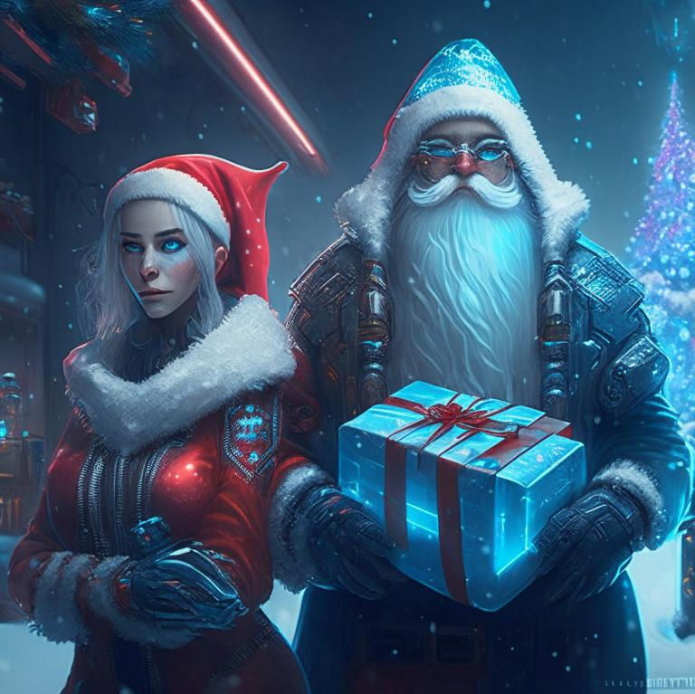

# DedMorozClassification2023

В декабре вы помогли Деду Морозу создать подарки для детей (https://github.com/kafvtpnz/DedMorozChallenge2022). 
Благодаря вашим алгоритмам все дети получили подарки, но остались не использованные игрушки.

Снегурочка предложила сделать маркетинговое исследование и делать подарки каждому ребенку по его интересам. Для выявления интересов детей был запущен краулер, который собрал скриншоты с гаджетов детей для определения компьютерных игр в которые они играют.  

# Задача:

1. Создать нейронную сеть, обеспечивающую классификацию *компьютерных игр* по их скриншотам.
2. Метрика качества - усредненная точность (accuracy) по всем классам (читать тут https://habr.com/ru/post/661119/) на тестовом наборе данных https://drive.google.com/file/d/12j-EOaBBDQ81QkOk8xQTlIcd9zDWvqg2/view.
3. Обучающий набор данных размещен по ссылке https://drive.google.com/file/d/1TV266d-PKNuuWWA2Sy0HmuIVJ1HpLIzP/view?usp=share_link

# Приз для авторов 5ти лучших решений: 

# *Автомат по нейронкам.*

# Приз для автора лучшего решения: 
# *Флешка.*
